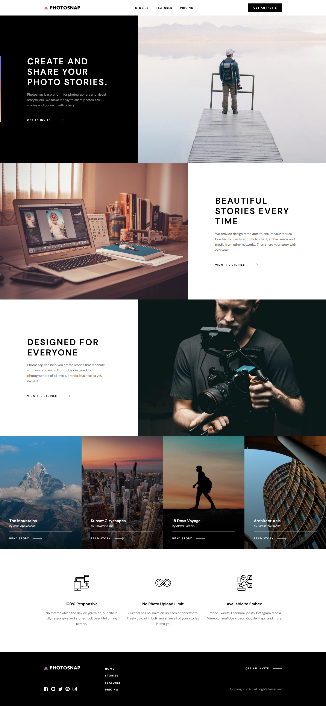

# Frontend Mentor - Photosnap Website solution

This is a solution to the [Photosnap Website challenge on Frontend Mentor](https://www.frontendmentor.io/challenges/photosnap-multipage-website-nMDSrNmNW). Frontend Mentor challenges help you improve your coding skills by building realistic projects.

## Table of contents

- [Frontend Mentor - Photosnap Website solution](#frontend-mentor---photosnap-website-solution)
  - [Table of contents](#table-of-contents)
  - [Overview](#overview)
    - [The challenge](#the-challenge)
    - [Screenshot](#screenshot)
    - [Links](#links)
  - [My process](#my-process)
    - [Built with](#built-with)
    - [What I learned](#what-i-learned)
    - [Useful resources](#useful-resources)
  - [Author](#author)

## Overview

### The challenge

Users should be able to:

- View the optimal layout for each page depending on their device's screen size
- See hover states for all interactive elements throughout the site

### Screenshot

### Links

- Solution URL: [Github](https://github.com/abhijitbcob/photosnap-multi-page-website)
- Live Site URL: [Netlify](https://photosnap-multipage-website.netlify.app/index.html)

## My process

### Built with

- Semantic HTML5 markup
- CSS custom properties
- Flexbox
- CSS Grid
- Mobile-first workflow
- Vanilla JavaScript

### What I learned

- Writing utility-first css makes code DRY and more maintainable.
- some new layout with Flexbox and Grid.
- Some deeper understanding of position: absolute;
- changing style of SVG programatically.
- making responsive mobile navigation menu with vanilla js
- how to use css combinator more precisely.
- making images responsive in HTML.
- :focus-visible, :focus-within pseudo class for enhancing user accessibility.
- how make good folder structure of SASS files.

### Useful resources

- [7-1 Sass Architecture](https://www.example.com) - I really liked this pattern and will use it going forward.
- [Kevin powell](https://www.youtube.com/user/KepowOb) - This guy is really making awesome tutorials on css. I'd recommend his channel to anyone who want to deep dive into css.

## Author

- Frontend Mentor - [@abhijitbcob](https://www.frontendmentor.io/profile/abhijitbcob)
- Twitter - [@Abhijit46752961](https://twitter.com/Abhijit46752961)
